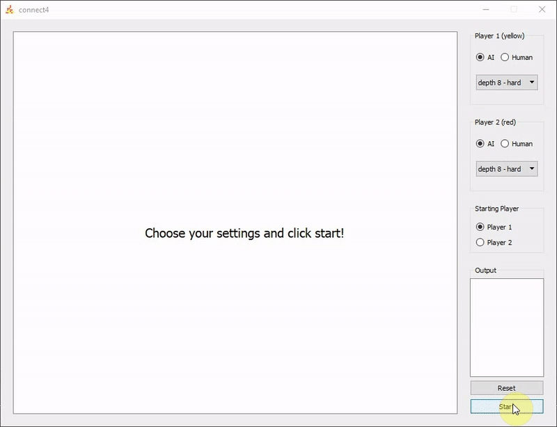

# Connect4-cpp

QT UI to play connect 4 against another human player or an AI. AI vs AI is possible aswell. A minimax algorithm with alpha-beta pruning is used to generate AI moves.

known bugs: crashes at exit, probably some deletion of non-existing pointer, could not find where.

todos: icon only works for windows systems

last commit of ai.h and ai.cpp runs the logic on 7 instead of 1 thread
